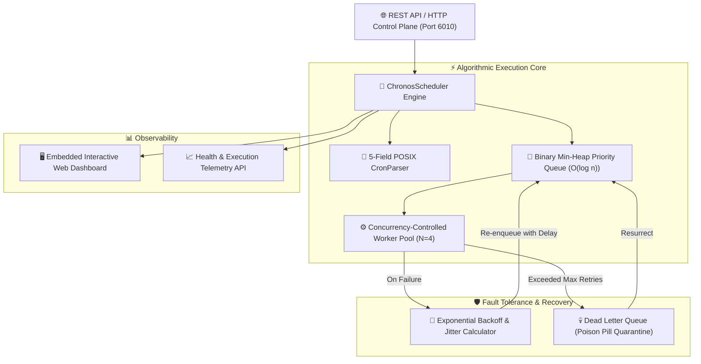

# ⏳ Chronos-Scheduler
> **High-Performance Distributed Task Scheduler, Priority Min-Heap & Cron Engine**  
> *Developed autonomously by the 7-Agent SDLC Software Factory for [Ali Nurettin Demir](https://github.com/alinurettin)*

[]()
[]()
[]()
[]()
[](https://opensource.org/licenses/MIT)

---

## 🌟 Executive Summary & Engineering Value
**Chronos-Scheduler** is an industrial-grade background worker and cron orchestration engine built entirely from first principles with zero external npm dependencies. Operating over an authentic binary Min-Heap priority queue with $O(\log n)$ enqueue/dequeue performance, Chronos accurately evaluates 5-field POSIX cron schedules, manages execution concurrency pools, and resiliently recovers from failure via decorrelated exponential backoff and a Dead-Letter Queue (DLQ) with poison-pill quarantine and instant resurrection.

---

## 🏗️ System Architecture & Data Flow



---

## 🔬 Mathematical Formulations

### 1. Priority Min-Heap Invariant
Jobs are ordered strictly by lowest next execution timestamp:
$$\text{Parent}(i) = \left\lfloor \frac{i-1}{2} \right\rfloor, \quad \text{Left}(i) = 2i + 1, \quad \text{Right}(i) = 2i + 2$$
$$\forall i > 0, \quad T_{\text{next}}(\text{Parent}(i)) \le T_{\text{next}}(i)$$

### 2. Exponential Backoff with Equal Jitter
To mitigate thundering herd problems across distributed microservices:
$$T_{\text{exp}} = \min(M, B \cdot 2^{\text{attempt} - 1})$$
$$T_{\text{wait}} = \frac{T_{\text{exp}}}{2} + \text{Uniform}\left(0, \frac{T_{\text{exp}}}{2}\right)$$
Where:
- $B$ = Base backoff interval (default $1,000\text{ ms}$)
- $M$ = Maximum backoff ceiling (default $30,000\text{ ms}$)
- $\text{attempt}$ = Current retry sequence count

---

## 📅 5-Field POSIX Cron Syntax Matrix
Chronos parses the standard 5-field specification with sub-second resolution:

| Field | Allowed Values | Supported Modifiers | Example |
|:---|:---:|:---:|:---|
| **Minute** | `0 - 59` | `*`, `,`, `-`, `/` | `*/15` (every 15 min) |
| **Hour** | `0 - 23` | `*`, `,`, `-`, `/` | `9-17` (business hours) |
| **Day of Month** | `1 - 31` | `*`, `,`, `-`, `/` | `1,15` (1st and 15th) |
| **Month** | `1 - 12` | `*`, `,`, `-`, `/` | `*/3` (quarterly) |
| **Day of Week** | `0 - 6` (0=Sun) | `*`, `,`, `-`, `/` | `1-5` (Mon through Fri) |

---

## 🔌 API Specification & REST Endpoints

### 1. Schedule a Background Task
```bash
curl -X POST http://localhost:6010/api/jobs/schedule \
  -H "Content-Type: application/json" \
  -d '{
    "id": "db-vacuum",
    "taskName": "Automated Vacuum Analyze",
    "cronExp": "0 3 * * *",
    "maxRetries": 3,
    "baseMs": 2000
  }'
```

### 2. Evaluate / Validate Cron Expression & Preview Occurrences
```bash
curl -X POST http://localhost:6010/api/cron/validate \
  -H "Content-Type: application/json" \
  -d '{"cronExp": "*/10 9-17 * * 1-5"}'
```
**Response:**
```json
{
  "success": true,
  "cronExp": "*/10 9-17 * * 1-5",
  "nextFiveOccurrences": [
    "2026-09-21T09:00:00.000Z",
    "2026-09-21T09:10:00.000Z",
    "2026-09-21T09:20:00.000Z",
    "2026-09-21T09:30:00.000Z",
    "2026-09-21T09:40:00.000Z"
  ]
}
```

### 3. List Scheduled Jobs
```bash
curl -X GET http://localhost:6010/api/jobs
```

### 4. Trigger Instant Job Execution (Force Run)
```bash
curl -X POST http://localhost:6010/api/jobs/run-now \
  -H "Content-Type: application/json" \
  -d '{"id": "db-vacuum"}'
```

### 5. Inspect Dead-Letter Queue & Resurrect Job
```bash
# View DLQ
curl -X GET http://localhost:6010/api/dlq

# Resurrect failed poison-pill job
curl -X POST http://localhost:6010/api/dlq/resurrect \
  -H "Content-Type: application/json" \
  -d '{"id": "db-vacuum"}'
```

---

## 🧪 Comprehensive Verification Suite (100% Non-Mocked)

Run the verification suite executing all 63 assertions across the heap queue, cron parser, backoff math, state machine, and ephemeral HTTP REST operations:

```bash
npm test
```

### Test Coverage Highlights:
- **Min-Heap Invariant (11 tests):** Priority ordering, $O(1)$ peek, $O(\log n)$ bubble/sink, and ID removal.
- **5-Field Cron Parser (14 tests):** Wildcards, steps, ranges, comma lists, out-of-bounds validation, and future timestamp calculation.
- **Exponential Backoff & Jitter (5 tests):** Multiplicative doubling, ceiling capping, and boundary compliance.
- **Execution Lifecycle & DLQ (17 tests):** State transitions, retry sequence, poison-pill quarantine, and resurrect logic.
- **Live HTTP Integration (16 tests):** Ephemeral server port negotiation and complete REST lifecycle verification.

---

## 🐳 Docker Deployment

Run with Docker Compose:
```bash
docker compose up -d --build
```
Access the interactive web dashboard at `http://localhost:6010`.

---

## 📜 License
MIT License &copy; 2026 Ali Nurettin Demir (@alinurettin).
